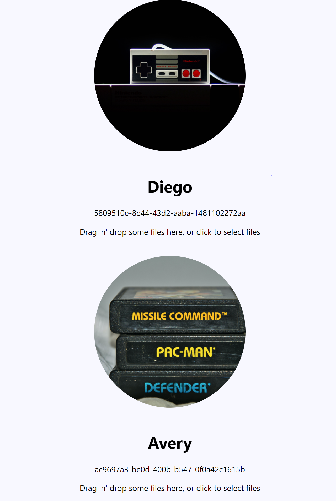

# images-to-s3
This is application that uses the Java Spring Boot framework for the backend and React.js for the front end

The backend code can be found under aws-image-upload/src/main/java

The frontend code can be found under aws-image-upload/src/main/frontend

You will need your own credential in order to connect to S3 (please look at java/config/AmazonConfig.java

Then you need to start the Spring Boot server from Eclipse or from IntelliJ

Then run this inside of inside of aws-image-upload/src/main/frontend: 

run npm i && npm start 
